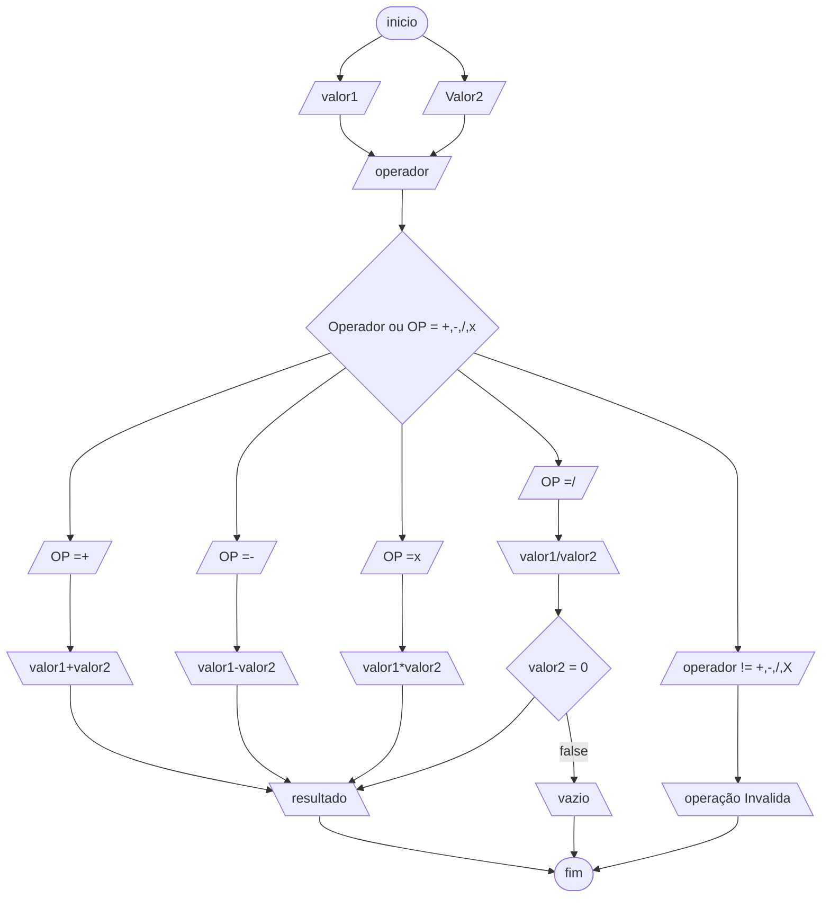

# Fluxograma

```mermaid
graph TD
A([inicio])
C[/valor1/]
D[/Valor2/]
B([fim])
E{Operador ou OP = +,-,/,x}
F[/OP =+/]
G[/OP =-/]
H[/OP =//]
I[/OP =x/]
J[\operação Invalida\]
K[\vazio\]
L[\valor1+valor2\]
M[\valor1-valor2\]
N[\valor1*valor2\]
O[\valor1/valor2\]
P{valor2 = 0}
R[\resultado\]
S[/operador != +,-,/,X/]
T[/operador/]

A--> C
A--> D
E--> F
E --> G
E--> H
E --> I
F--> L
G-->M
H-->O
O-->P
P --false--> K
I-->N
L --> R
M -->R
N--> R
P --> R
E --> S
S--> J
C--> T
D--> T
R--> B
T-->E
K-->B
J-->B
```
